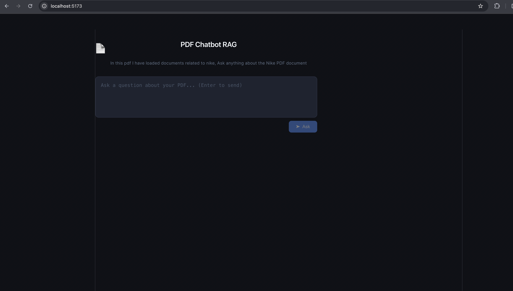
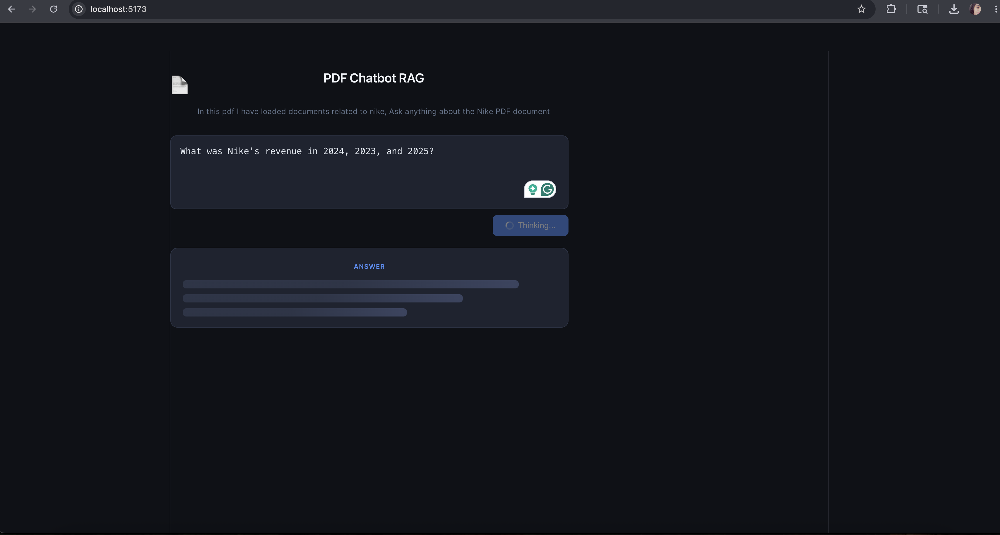
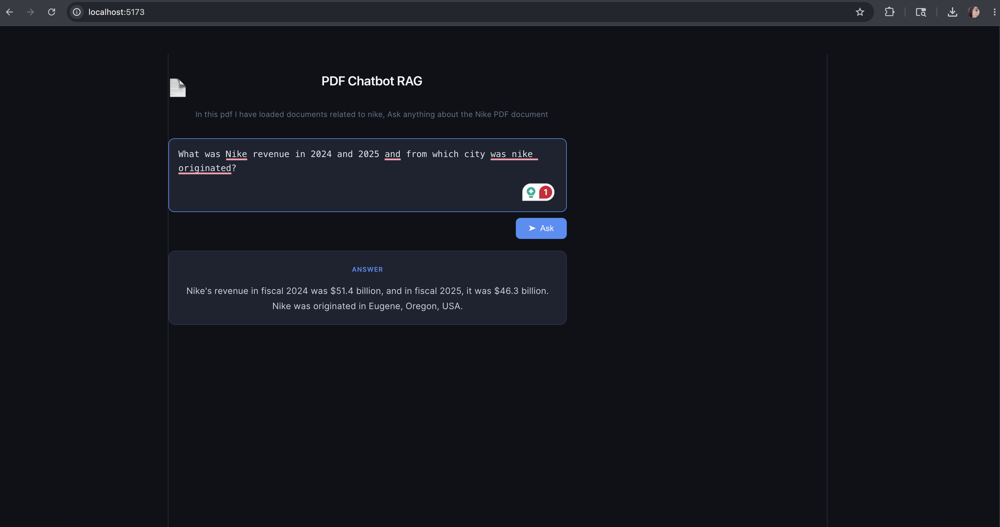

# 📄 PDFReaderRag

A full-stack AI-powered application that lets users upload PDF documents and ask natural language questions about their content — powered by **Retrieval-Augmented Generation (RAG)**.

---

## 🚀 What It Does

Upload any PDF and chat with it. The app parses, chunks, and embeds the document into a vector store, then uses semantic search + an LLM to answer your questions with context pulled directly from the file — no hallucinations from memory alone.

**Example use cases:**
- Summarize a research paper
- Ask questions about a legal contract
- Extract key info from a lengthy report

---

## 🛠️ Tech Stack

| Layer      | Technology                              |
|------------|------------------------------------------|
| Frontend   | React, TypeScript, CSS                  |
| Backend    | Node.js, TypeScript, Express            |
| AI / RAG   | LangChain.js, OpenAI Embeddings         |
| Parsing    | `pdf-parse`, `@langchain/community`     |
| Chunking   | `@langchain/textsplitters`              |
| Vector Search | In-memory vector store (LangChain)  |

---

## 🧠 How It Works

```
PDF Upload
   ↓
Document Loader (pdf-parse)
   ↓
Text Splitter → Chunks
   ↓
OpenAI Embeddings → Vectors
   ↓
Vector Store (semantic search)
   ↓
User Query → Relevant Chunks → LLM → Answer
```

---

## 📦 Getting Started

### Prerequisites
- Node.js v18+
- OpenAI API key

### Installation

```bash
# Clone the repo
git clone https://github.com/rutushah/PDFReaderRag.git
cd PDFReaderRag

# Install backend dependencies
cd Backend
npm install

# Install frontend dependencies (if applicable)
cd ../frontend
npm install
```

### Environment Setup

Create a `.env` file in the `Backend` directory:

```env
OPENAI_API_KEY=your_openai_api_key_here
PORT=3000
```

### Run the App

```bash
# Start the backend
cd Backend
npx tsx server.ts
```

```bash
# Start the frontend (in a separate terminal)
cd ../frontend
npm run dev
```

---

## 📁 Project Structure

```
PDFReaderRag/
├── Backend/          # Express + LangChain RAG pipeline
├── frontend/         # UI for uploading PDFs and querying
├── .gitignore
└── README.md
```

---

## 🔑 Key Concepts Implemented

- **Document Loading** — Parsing PDFs into raw text using `pdf-parse`
- **Text Splitting** — Breaking large documents into overlapping chunks for better retrieval
- **Embeddings** — Converting text to vectors using OpenAI's embedding models
- **Semantic Search** — Finding the most relevant chunks for a given query
- **RAG Pipeline** — Combining retrieved context with an LLM for grounded answers

---

## 📌 Future Improvements

- [ ] Persist vector store to a database (e.g., Pinecone, Chroma)
- [ ] Support multiple file uploads
- [ ] Add chat history / conversation memory
- [ ] Deploy to Vercel + Railway

---
## 📸 Demo

| Upload PDF | Ask Questions |
|------------|---------------|
|  |  
| 

## 📜 License

MIT — see [LICENSE](./LICENSE) for details.
